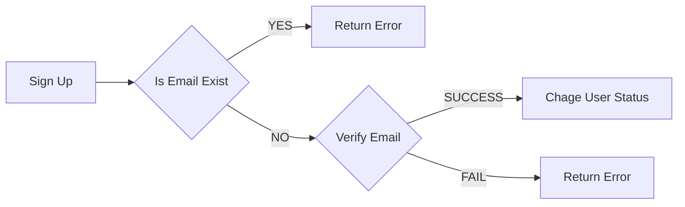
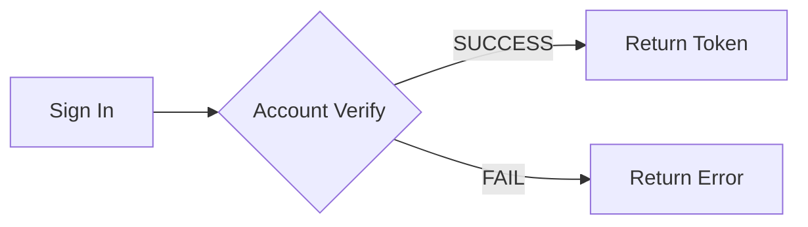
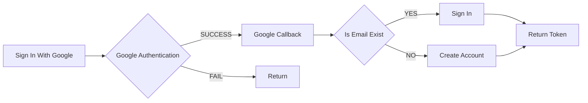
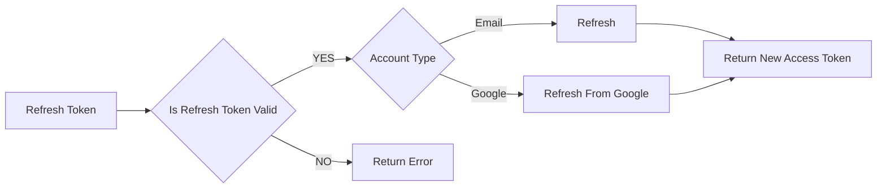

# Simple User Sys
This simple app side project allows users to sign in and view basic users dashboard and statistics.

Signing up will send a verification email to the user. Use the token provided in the email to send a request to `/api/user/v1/email/verify` to verify the email.

User activities are stored in Redis and backed up to MySQL by a scheduler. You can decide when it should run by changing the env variable `SCHEDULE_SETTING`.

## Prerequisites
- This app is wrapped in a Docker image. Before using it, please make sure you've installed Docker on your local environment.
- Prepare your own Google developer and SendGrid API settings.
- Create a `.env` file at the root, and it must contain the following:
```
DOMAIN=http://localhost:3000
ORIGIN=http://localhost:3000
// cors origin
EMAIL_REDIRECT= {Verification Email URI}
MYSQL_HOST=localhost
MYSQL_ACCOUNT=root
MYSQL_PASSWORD=root
MYSQL_PORT=3306
MYSQL_DATABASE=user_db
MYSQL_TIMEZONE=+00:00
REDIS_HOST=127.0.0.1
REDIS_PORT=6379
REDIS_DB=0
REDIS_USER={Redis Account}
// leave empty if you don't need it
REDIS_PASSWORD={Redis Password}
// leave empty if you don't need it
ACCESS_TOKEN_EXPIRE=30m
REFRESH_TOKEN_EXPIRE=30d
EMAIL_TOKEN_EXPIRE=15m
EMAIL_MAX_TRY=5
SALT_ROUND=10
JWT_SECRET={Your Secret}
JWT_AUDIENCE=http://localhost:3000
JWT_ISSUER=http://localhost:3000/api
SENDGRID_API_KEY={Your SendGrid Secret}
SENDGRID_FROM={Your SendGrid Email Setting}
GOOGLE_CLIENT_ID={Your Google Client ID}
GOOGLE_CLIENT_SECRET={Your Google Client Secret}
GOOGLE_REDIRECT_URI={Your Google Redirect URI Setting}
SCHEDULE_SETTING=*/15 * * * *
```

## Basic
 
	./run.sh -u  
Runs all necessary Docker containers. It will start to pull MySQL, Redis, and Simple User App images if it does not find any in your local environment.

	./run.sh -d
 Shuts down the Docker containers.

	./run.sh -b
Builds Docker images from the current version.

	/.run.sh -h
Gets more info about this script.

## Current Feature
- Users
	-   Allows users to sign up and verify by email.
	-   Allows users to sign in with Basic Auth and Google OAuth2.
	-   Signs out and revokes user credentials.
- User dashboard
	-  Own profile
	    - Shows user's profile
	    - Allows users to update their username and password.
	-  User list
	    -  Retrieves user list with search and pagination.
	-  User statistics
	    -  Shows total user sign-ups.
	    -  Shows the total number of active users today.
	    -  Shows the average number of active users in the last seven days.

## Todo
-  Recovery mechanism
-  Log mechanism middleware

## FlowChart
### Sign Up


### Sign In


### Google Sign In


### Refresh Token
